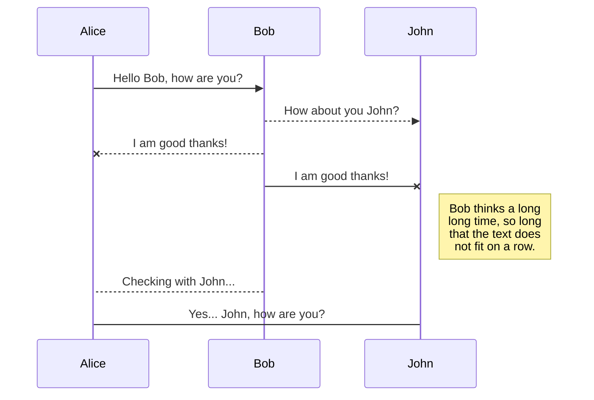
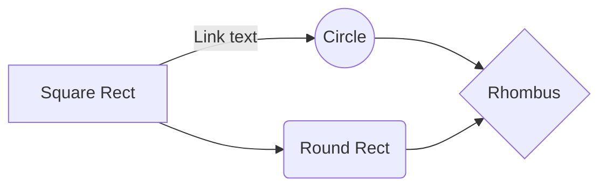

# git examp

# Welcome to StackEdit!

Thanks

# Files
Many files

## Create files and folders

No yet

## Switch to another file

No Thanks

## Rename a file

I will give examples....., one day

## Delete a file

no yet thanks

## Export a file

Maybe

# Synchronization

Yes, Thanks

## Open a file

I can Do it

## Save a file

Yes, Thanks

## Synchronize a file

I would like

## Manage file synchronization

No, thnaks

# Publication

Maybe

## Publish a File

It is very useful

## Update a publication

What???

## Manage file publication

Yes, yes, yes

# Markdown extensions

I don't know

## SmartyPants

Rather Smarty t-shirts 

|                |ASCII                          |HTML                         |
|----------------|-------------------------------|-----------------------------|
|Single backticks|`'Isn't this fun?'`            |'Isn't this fun?'            |
|Quotes          |`"Isn't this fun?"`            |"Isn't this fun?"            |
|Dashes          |`-- is en-dash, --- is em-dash`|-- is en-dash, --- is em-dash|

## KaTeX

I don¿t know

The *Gamma function* satisfying $\Gamma(n) = (n-1)!\quad\forall n\in\mathbb N$ is via the Euler integral

$$
\Gamma(z) = \int_0^\infty t^{z-1}e^{-t}dt\,.
$$

> You can find more information about **LaTeX** mathematical expressions [here](http://meta.math.stackexchange.com/questions/5020/mathjax-basic-tutorial-and-quick-reference).

## UML diagrams

You can render UML diagrams using [Mermaid](https://mermaidjs.github.io/). For example, this will produce a sequence diagram:

And this will produce a flow chart:

